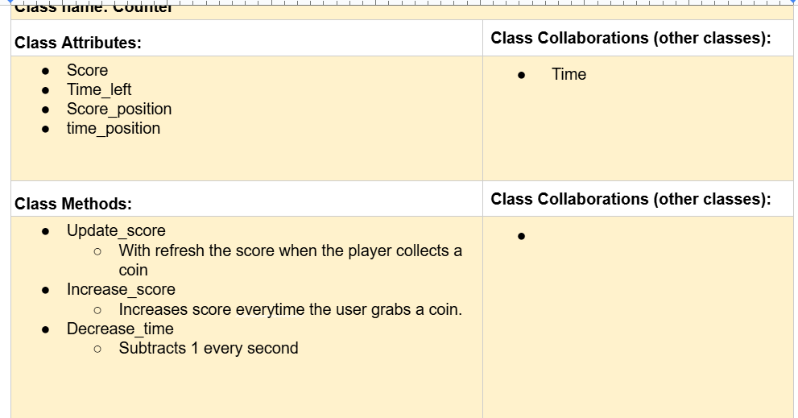
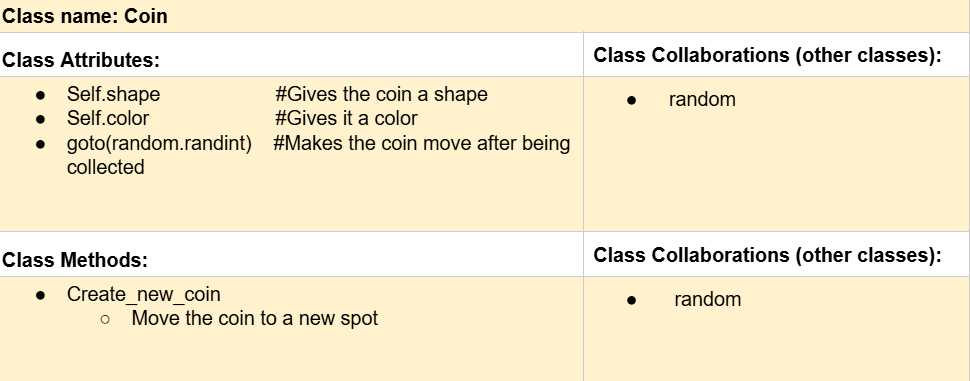
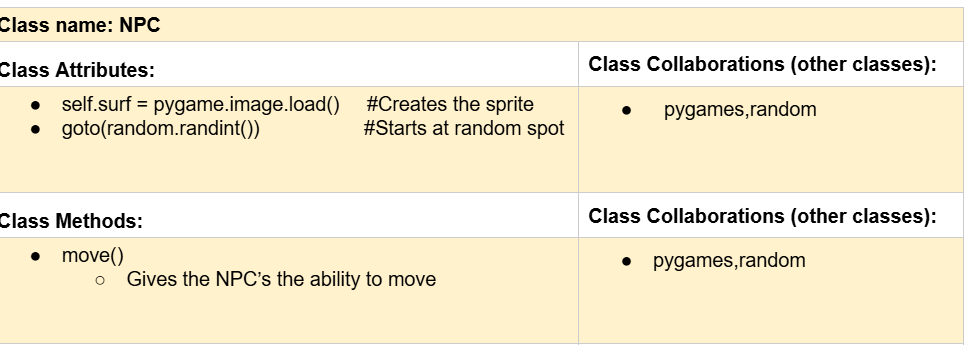

# CSC226 Final Project

## Instructions 

**Authors**: Scott Kirkpatrick, Osman Jalloh 

**Google Doc Link**: https://docs.google.com/document/d/1cApdfis-gja1YJMHgwJA3YZPHe-FNxz_uwBCb46HFF4/edit?tab=t.0
---

## Milestone 1: Setup, Planning, Design

️**Title**: Don't get Caught

**Purpose**: Get as many coins in the timeframe that you can.

️**Source Assignment(s)**: Seven_Turtle_Army, The_Legend_of_Tuna_Breath_of_Catnip

️**CRC Card(s)**:
  
 in place of this one. ")





️**Branches**:
```
    Branch 1 starting name: Kirkpatrickm
    Branch 2 starting name: OsmanJ
```
### References 

Throughout this project, you will likely use outside resources. Reference all ideas which are not your own, 
and describe how you integrated the ideas or code into your program. This includes online sources, people who have 
helped you, AI tools you've used, and any other resources that are not solely your own contribution. Update this 
section as you go. DO NOT forget about it!

An introduction to pygame to get a grasp on it.
https://youtu.be/y9VG3Pztok8?si=jwzufsW2BG0BC3QP 

To help create a timer that works.
https://www.programiz.com/python-programming/time

To help create boundries so the player and NPC cant run out of it.
https://www.bing.com/videos/riverview/relatedvideo?q=how+to+create+boundries+in+python&mid=F079186172C5B21E8B9BF079186172C5B21E8B9B&FORM=VIRE

To figure out how to shrink the rectangle.
https://www.pygame.org/docs/ref/rect.html

How to use the continue statement so that only one part of the code runs at once.
https://www.pythontutorial.net/python-basics/python-continue/
---

## Milestone 2: Code Setup and Issue Queue
```
    We have initialized the screen for our game as well as grabbed some sprites for our NPC to use. 
    We are feeling alirght about pacing as it took us about 2 hours to do that which is fair. Most of our time has been with planning so far.
    We are worried about a couple things; one is working with pygames as neither of us are to familair with it so it has been an adjustment, we are also both pretty busy so time managment has been rough.
    Not many suprises so far. We're a little nervous about this project but it should be managable.
```

---

## Milestone 3: Virtual Check-In

**Completion Percentage**: `55%`

**Confidence**:
```
    **We should be able to finish the project as long as we have no significant issues with duplicating the NPC which sounds difficult.
    We need to have more effective communication as well as more efficent coding sessions.
```

---

## Milestone 4: Final Code, Presentation, Demo

### User Instructions

    **You will be hit by a start up screen, hit the space button to begin the game. When the game begins use the arrow keys to move and collect coins.
    **Make sure to avoid the other people on the screen or you will lose. Collect as many coins as possible before the time runs out.

### Errors and Constraints

Every program has bugs or features that had to be scrapped for time. These bugs should be tracked in the issue queue. 
You should already have a few items in here from the prior weeks. Create a new issue for any undocumented errors and 
deficiencies that remain in your code. Bugs found that aren't acknowledged in the queue will be penalized.

### Reflection

```
    Osman:We selected this project out of fun, we looked at the Tuna game as asked our selves how can we make this game better 
    by adding more NPC and increasing the game speed etc. 
    Our project i could say is closely with what we imagine it to be, it just that we could have made more visually appealing to users
    but we instead focus on making sure it works correctly and avoid as many bugs as possible. 
    I learn alot about how classes and objects works and how code at large scale is being managed. 
    The hardest part was on creating the coalition between the NPC and the player so they donn't run into eachother. 
    We would try to write the code using a seperate file for each class so that we can easily access it when necessary. Also, we could design the 
    and entire the program to enhance user experience. 
    I was able to work with Patrick preety well. He always communicate every things he does on the code and i do the same as well. And we understand 
    eachother milestone on the project and we are supposed to do at it point in time. Some of the challanges we faced is been able to meet to work together in person. 
    We had differnt work schedule so that was a big challange. 
    
    
    
    
    
```
 
```
    Scott: We selected a project based on the ability we believed we had to accomplish our derective. We didnt want to do anything to grand and fail to accomplish our goal so we decided to
    use older projects as a model and work from there. We followed our initial plan pretty faithfully without any huge issues along the process. We has some initial ideas that didnt make the cut
    such as the NPC's spawing from each other rather than an initial designed point but that wasent a huge concern in the long run. We ended up learning quite a bit mostly regarding pygames a program
    which we didnt know how to use very well before hand. I believe we have a more crucial understanding of how classes relate to objects as well as how classes interact with each other.
    
    The most difficult parts of the project came from two different points: The first would be finding time to work on the project while dealing with all of my other classes cource work.
    It was very difficult to write a 15 page paper then come and code. The most difficult part of the project itself was making the NPC's have more than one. I had to do some research regarding lists and how those
    interact with classes to understand that issue. I wouldnt do much differently next time. I would definitly make it more colorful and put more work into the artistic side of the game rather than making it pure functionality,
    but we did want to make sure the game actually worked. I would also like to add more to help the player because the NPC's are tough to avoid at times.
    
    Working with a partner was challenging, but rewarding. We both have very different schedules and I go home alot so it was challenging to work together in person alot. We did communicate about what we were doing with the other person
    and we both left alot of comments so the other person would know what they were doing as well.Our visions of the game were also the same almost the entire time so no idealogical differences arised. Overall it went pretty well.
```

---